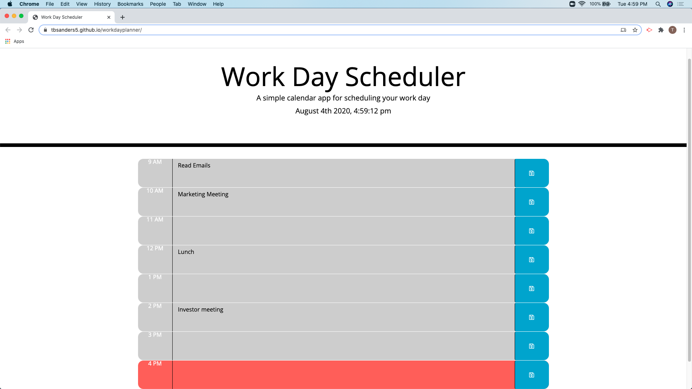

# Workday Planner #

[Github pages link](https://tbsanders5.github.io/workdayplanner/)

## Description ##
This program is a simpled daily planner for your work-day. It starts at 9am, standard work day, and ends at 5pm. The hours will highlight diffrent colors depending on what hour you are on. The items will be saved in local storage so that when the page is refreshed the items you have entered will still stay in the block. The page has a save button on the side in order to perfrom this save. The application will pull the users current date and time and diplay it on the top of the page. This will also come in handy when the application is used in other times zones as it will change based on the users computer settings.

## Resources ##

* [Nancy Lambert-Brown](https://github.com/n-lambert)
* [Plover Brown](https://github.com/rebgrasshopper)
* [Zachary Bryan](https://github.com/zacharybryan)
* [Nicholas Konzen](https://github.com/NTKonzen)
* [Talia Vazquez](https://github.com/taliavazquez)

## Usage ##

1. Enter in what needs to be done by hour.
1. Press the save button to save to local directory.
1. Red box indicates present time, grey is past time, green is future time

## License ##

GNU General Public License

---

Copyright (c) 2020 Sanders, Timothy

Permission is hereby granted, free of charge, to any person obtaining a copy
of this software and associated documentation files (the "Software"), to deal
in the Software without restriction, including without limitation the rights
to use, copy, modify, merge, publish, distribute, sublicense, and/or sell
copies of the Software, and to permit persons to whom the Software is
furnished to do so, subject to the following conditions:

The above copyright notice and this permission notice shall be included in all
copies or substantial portions of the Software.

THE SOFTWARE IS PROVIDED "AS IS", WITHOUT WARRANTY OF ANY KIND, EXPRESS OR
IMPLIED, INCLUDING BUT NOT LIMITED TO THE WARRANTIES OF MERCHANTABILITY,
FITNESS FOR A PARTICULAR PURPOSE AND NONINFRINGEMENT. IN NO EVENT SHALL THE
AUTHORS OR COPYRIGHT HOLDERS BE LIABLE FOR ANY CLAIM, DAMAGES OR OTHER
LIABILITY, WHETHER IN AN ACTION OF CONTRACT, TORT OR OTHERWISE, ARISING FROM,
OUT OF OR IN CONNECTION WITH THE SOFTWARE OR THE USE OR OTHER DEALINGS IN THE
SOFTWARE.